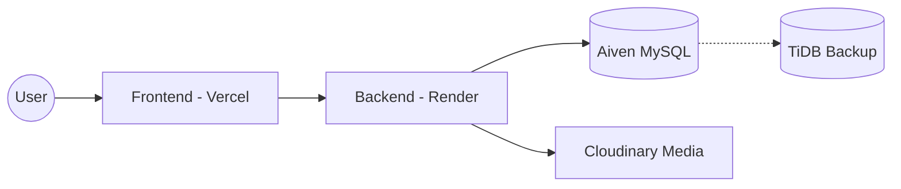

<div align="center">
  
  <h1>🏫 Vision Public School (VPS)</h1>
  <p><strong>The All-in-One Enterprise School Management System</strong></p>

  <div>
    
    
    
    
  </div>

  <br />

  ---

  [Explore Features](#-features) • [User Guide](#-user-operations-manual) • [Setup Guide](#-developer-setup) • [Support](#-support--faq)

  ---
</div>

<br />

## 🌟 Overview
Vision Public School (VPS) is a high-performance, cloud-native ERP system designed to digitize every aspect of school administration. Built with a **modern glassmorphism UI**, it ensures that students, parents, faculty, and management stay connected through a unified digital ecosystem.

---

## 📸 Interface Previews

<details open>
<summary><strong>🔍 Click to Expand: System Dashboards</strong></summary>

| Student Hub | Admin Command Center |
| :---: | :---: |
|  |  |

| Faculty Portal | Finance Hub |
| :---: | :---: |
|  |  |

</details>

---

## 🛠️ Infrastructure & Stack

### **Service Providers**
| Component | Provider | Role | Status |
| :--- | :--- | :--- | :--- |
| **Backend** | Render | Spring Boot API | Always On (via Pinger) |
| **Frontend** | Vercel | React/Vite | Instant Load |
| **Primary DB** | Aiven | MySQL (Write) | Managed & Secure |
| **Secondary DB** | TiDB Cloud | MySQL (Read/Backup) | Auto-Synced Daily |
| **Artifacts** | GitHub | SQL Backups | Stored for 5 Days |

### **Architecture Flow**


---

## 🧑‍💻 User Operations Manual

<details>
<summary><strong>🎓 For Students & Parents</strong></summary>

### **Operations**
1.  **Fee Payment**: Scan the QR code in the **Fees** section, pay via UPI, and upload the receipt.
2.  **Academic tracking**: Access **Homework**, **Syllabus**, and **Study Materials** from the sidebar.
3.  **Live Class**: Click the green **Join** button when a session is active.
4.  **Results**: Instantly download marksheets from the **Marks** tab.

### **Visual Guide**

*Typical payment process for students*

</details>

<details>
<summary><strong>👩‍🏫 For Faculty & Teachers</strong></summary>

### **Operations**
1.  **Attendance**: Toggle **P/A** for your assigned class and click **Save**.
2.  **Assigning Content**: Use the **Create Content** panel to post homework and syllabus.
3.  **Virtual Classroom**: Enter a topic and click **Go Live** to start a session.

### **Visual Guide**

*Homework creation portal for teachers*

</details>

<details>
<summary><strong>🛠️ For Management & Staff</strong></summary>

### **Operations**
1.  **Finance**: Verify student payments and generate class-wise collection reports.
2.  **Notice Board**: Broadcast urgent school-wide announcements.
3.  **User Management**: Register new students and staff members.

### **Visual Guide**

*Central notice board for school-wide communication*

</details>

---

## 🚀 Developer Setup

<details>
<summary><strong>⚙️ Requirements & Installation</strong></summary>

> [!IMPORTANT]
> Ensure you have Node.js (v18+) and JDK (v17+) installed before proceeding.

### **1. Configure Environment**
Rename the sample env files and fill in your secrets:
*   **Backend**: Edit `src/main/resources/application.properties` (MySQL/Cloudinary/JWT).
*   **Frontend**: Create `.env` with `VITE_API_BASE_URL`.

### **2. Local Execution**
```bash
# Start Backend
cd vps-backend && mvn spring-boot:run

# Start Frontend
cd vps-frontend && npm install && npm run dev
```
</details>

---

## 🆘 Support & FAQ

> [!TIP]
> Always use Chrome or Edge for the smoothest experience with interactive charts and video sessions.

*   **Q: How do I reset my password?**  
    Contact the school Admin to trigger a secure reset from the dashboard.
*   **Q: Where can I Find SQL Backups?**  
    Backups are stored in the GitHub Artifacts section of this repository for up to 5 days.

---
<div align="center">
  <p><i>Vision Public School - Excellence in Every Action</i></p>
</div>
