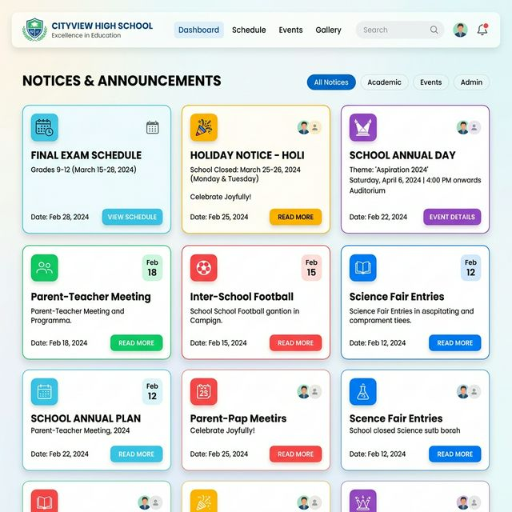
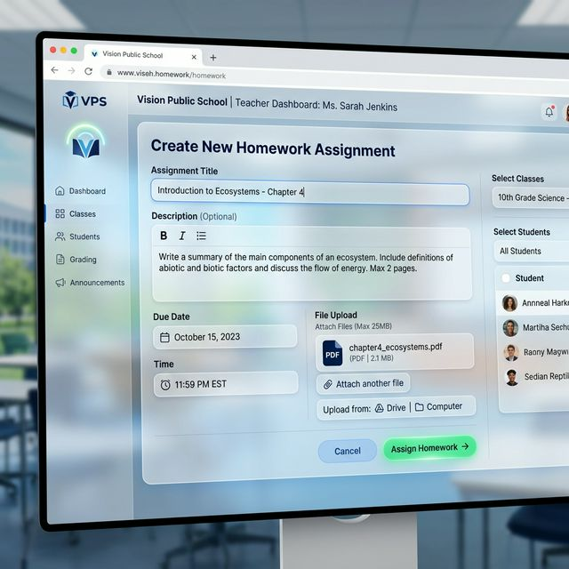
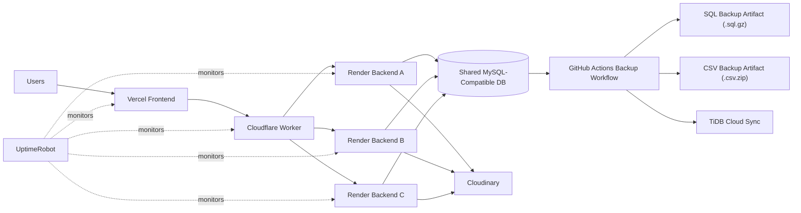
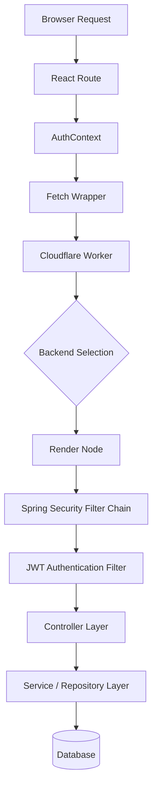
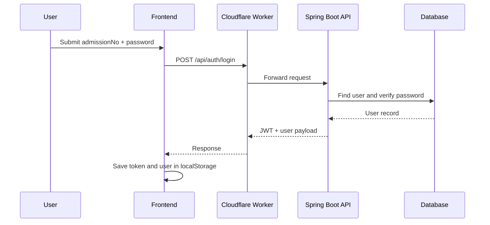
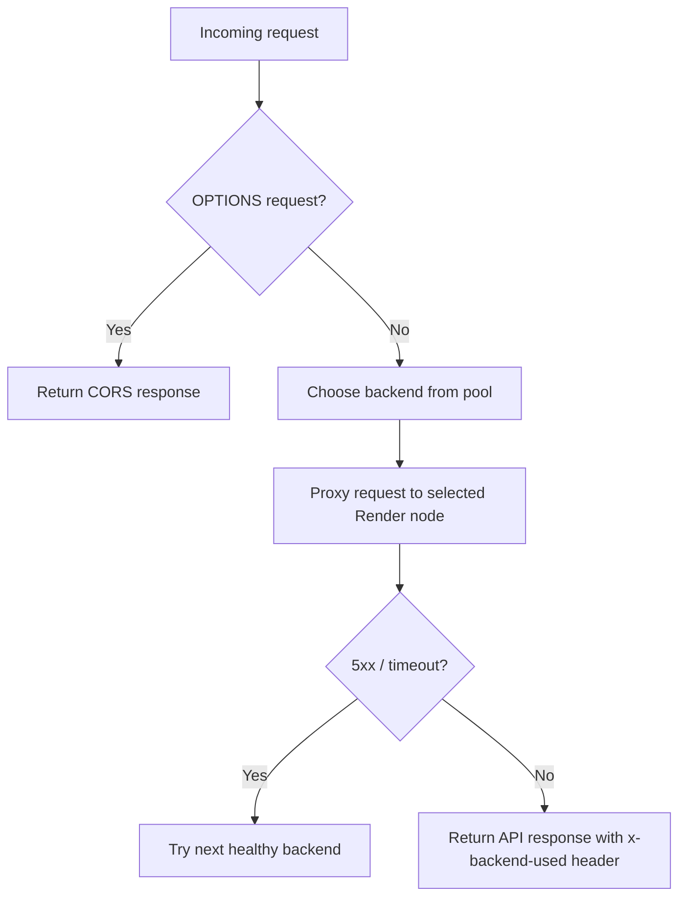
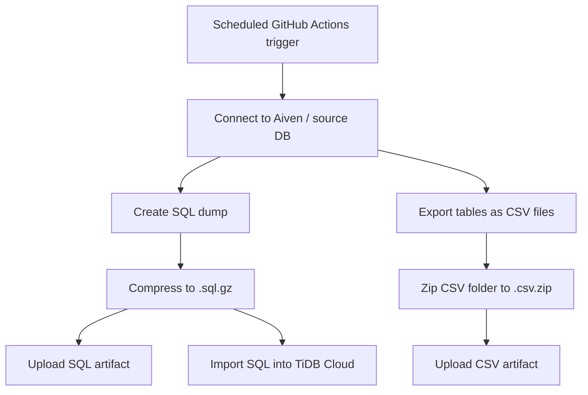

# Vision Public School ERP

<div align="center">
  

  <h3>Modern school management platform for students, teachers, staff, and administrators</h3>

  <p>
    
    
    
    
  </p>

  <p>
    <a href="#overview">Overview</a> |
    <a href="#screenshots">Screenshots</a> |
    <a href="#high-level-design-hld">HLD</a> |
    <a href="#low-level-design-lld">LLD</a> |
    <a href="#quick-start">Quick Start</a> |
    <a href="#deployment-flow">Deployment</a>
  </p>
</div>

---

## Overview

Vision Public School ERP is a full-stack school management system that brings academic, administrative, finance, and engagement workflows into one application.

It includes:

- role-based dashboards for `ADMIN`, `TEACHER`, `STUDENT`, and staff users
- attendance, marksheet, syllabus, homework, notices, payments, certificates, transport, blog, and gallery modules
- JWT-based authentication with a React frontend and Spring Boot backend
- cloud deployment using `Vercel` for frontend and `Render` for backend
- Cloudflare Worker-based edge proxy and failover routing for backend availability

---

## Why This Project

- Schools often use disconnected tools for attendance, fee tracking, notices, marks, and content.
- This project brings those workflows into one UI and one API.
- It is designed to be practical for real deployment, not just a demo CRUD app.

---

## Core Modules

| Module | Highlights |
| --- | --- |
| Authentication | JWT login, role-aware navigation, protected routes |
| Student Management | admissions, profile records, class/section mapping |
| Academics | homework, syllabus, study material, marksheets, analytics |
| Communication | notices, Q&A, live class, blog, poll system |
| Operations | attendance, visitors, transport, health profile, inventory |
| Finance | payment submission, verification flow, reporting |
| Media | gallery, uploads, Cloudinary-backed media handling |

---

## Screenshots

<details open>
<summary><strong>Open screenshot gallery</strong></summary>

| Login | Student Dashboard |
| --- | --- |
|  |  |

| Teacher Dashboard | Admin Dashboard |
| --- | --- |
|  |  |

| Payment Flow | Notice Board |
| --- | --- |
|  |  |

| Homework Flow | Finance Reports |
| --- | --- |
|  |  |

</details>

---

## Tech Stack

### Frontend

- React 18
- Vite
- React Router
- Framer Motion
- Recharts
- Tailwind CSS

### Backend

- Spring Boot
- Spring Security
- JPA / Hibernate
- JWT authentication
- MySQL-compatible database

### Infrastructure

- Vercel for frontend hosting
- Render for backend hosting
- Cloudflare Worker for API routing and backend failover
- Cloudinary for media uploads
- UptimeRobot for external uptime monitoring of frontend, Worker, and backend URLs

---

## High Level Design (HLD)



### HLD Notes

- Frontend stays stable behind one public domain.
- Backend traffic is routed through a Cloudflare Worker.
- Multiple Render services can serve the same API.
- All backend instances must use the same shared database and matching environment configuration.
- GitHub Actions creates dual database backups as SQL and CSV artifacts, and syncs SQL data to TiDB Cloud.

---

## Low Level Design (LLD)



### Authentication Sequence



### Backend Request Routing



### Backup Flow



---

## Current Deployment Flow

### Production Routing

```text
Vercel frontend -> Cloudflare Worker -> Render backend pool -> shared database
```

### Important Production Notes

- `VITE_API_BASE_URL` should not end with a trailing slash.
- The frontend now normalizes trailing slashes automatically.
- Vercel uses SPA rewrites so routes like `/admin` work on refresh.
- The Worker is responsible for retrying healthy Render nodes when one backend is down.
- Important public URLs are monitored through UptimeRobot.

---

## Project Structure

```text
.
|-- assets/
|   `-- sop/                 # screenshots for documentation
|-- vps-frontend/            # React + Vite frontend
|-- vps-backend/             # Spring Boot backend
|-- DEPLOY.md
|-- FULL_SYSTEM_DOCUMENTATION.md
|-- MONITORING.md
|-- SOP.md
|-- TECHNICAL_ARCHITECTURE.md
`-- USER_MANUAL.md
```

---

## Quick Start

### Prerequisites

- Node.js 18+
- npm
- Java 17+
- Maven
- MySQL-compatible database

### Frontend

```bash
cd vps-frontend
npm install
npm run dev
```

### Backend

```bash
cd vps-backend
mvn spring-boot:run
```

### Frontend Environment

Create a `.env` file in `vps-frontend`:

```env
VITE_API_BASE_URL=http://localhost:8080
```

### Backend Environment

Configure runtime secrets for:

- `SPRING_DATASOURCE_URL`
- `SPRING_DATASOURCE_USERNAME`
- `SPRING_DATASOURCE_PASSWORD`
- `CLOUDINARY_CLOUD_NAME`
- `CLOUDINARY_API_KEY`
- `CLOUDINARY_API_SECRET`

---

## Cloudflare Worker Setup

This project supports multiple Render backends behind a single Worker URL.

Typical Worker responsibilities:

- CORS handling for the Vercel frontend
- proxying API traffic to Render
- passive failover when a backend is unavailable
- returning `x-backend-used` for easy debugging

If you add more Render services later, update only the backend pool inside the Worker config and redeploy the Worker.

---

## Monitoring

Production URLs are monitored in UptimeRobot:

- Vercel frontend
- Cloudflare Worker API entrypoint
- Render backend service URLs

Monitoring dashboard:

- [UptimeRobot Dashboard](https://dashboard.uptimerobot.com/monitors)

Recommended checks:

- homepage availability
- `/api/auth/login` reachability through Worker
- direct backend health endpoint such as `/healthz`
- response-time alerting for slow backend nodes

---

## Local Development Tips

- Use the frontend directly against local backend during development.
- Keep one shared staging database if you want to test multi-node Render behavior.
- Verify login, protected routes, and route refresh after deployment.
- Use browser DevTools and inspect the `x-backend-used` response header to identify which Render node served the request.

---

## Security Notes

Before production hardening, review:

- JWT secret management
- seeded default accounts
- route-level authorization on admin APIs
- password reset restrictions
- public upload exposure

Security review is strongly recommended before scaling usage.

---

## Documentation Map

- [DEPLOY.md](DEPLOY.md)
- [FULL_SYSTEM_DOCUMENTATION.md](FULL_SYSTEM_DOCUMENTATION.md)
- [MONITORING.md](MONITORING.md)
- [SOP.md](SOP.md)
- [TECHNICAL_ARCHITECTURE.md](TECHNICAL_ARCHITECTURE.md)
- [USER_MANUAL.md](USER_MANUAL.md)
- [DEPLOYMENT_NOTES.md](DEPLOYMENT_NOTES.md)
- [CODE_CHANGES_2026-04-18.md](CODE_CHANGES_2026-04-18.md)

---

## Roadmap Ideas

- active health-check endpoint for Worker routing
- admin audit logs
- stronger authorization rules per endpoint
- password reset and forced password-change workflow
- CI pipeline for frontend and backend deployment verification
- observability dashboard for multi-node backend health

---

## Maintainer Notes

If you are deploying this project in production:

- keep frontend on Vercel
- keep Worker as the single API entry point
- keep backend nodes stateless
- keep all backend nodes on the same code version
- keep all backend nodes on the same database and environment configuration

---

<div align="center">
  <sub>Built for a real school workflow, with production deployment and failover in mind.</sub>
</div>
