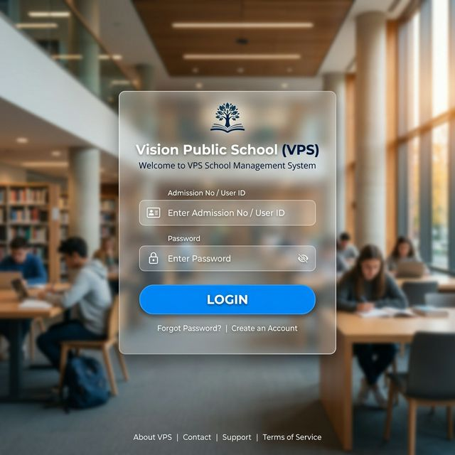
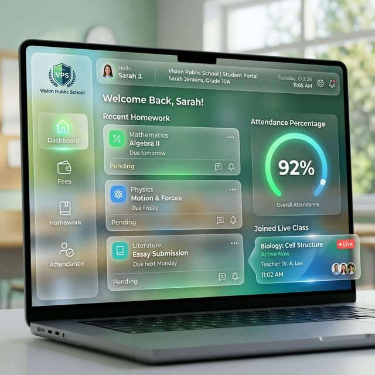
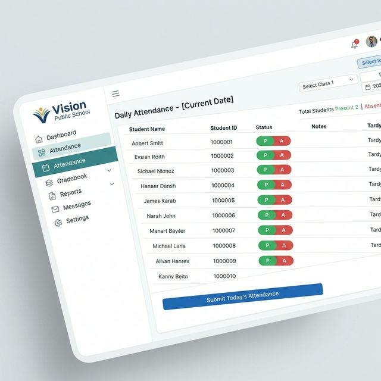
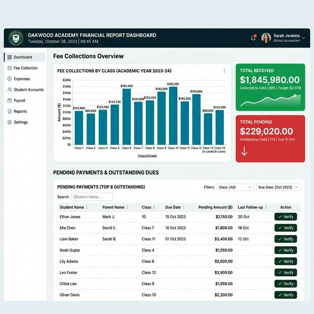
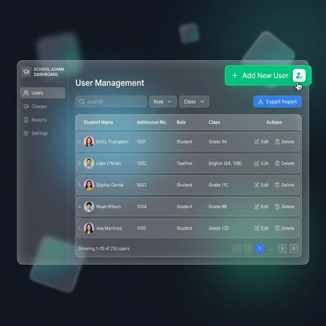

# Vision Public School (VPS) - Standard Operating Procedure (SOP)

This document provides a detailed guide on how to use the VPS School Management System. It is structured by user roles to help students, teachers, admins, and accountants perform their daily operations efficiently.

---

## 🔑 1. Getting Started: Login

For all users, the first step is to access the application and log in.

### **Steps to Login:**
1.  **Open Browser**: Navigate to the VPS web portal URL provided by the school.
2.  **Enter Credentials**:
    *   **Admission No / User ID**: Enter your registered ID (assigned during admission/hiring).
    *   **Password**: Enter your secret password.
3.  **Click Login**: You will be redirected to your specific dashboard based on your role.

---

## 🎓 2. Student & Parent Module

Students and Parents use the application to track academic progress and manage financial obligations.

### **Dashboard Overview**

### **Key Operations:**
*   **Checking Homework**: Click on **Homework** in the sidebar to view current assignments, download materials, and check due dates.
*   **Paying Fees**:
    1.  Go to the **Fees** section.
    2.  Scan the **QR Code** displayed on the screen using any UPI app (GPay, PhonePe, etc.).
    3.  After successful payment, take a screenshot of the receipt.
    4.  Click **Upload Receipt** and select your screenshot to submit for verification.
*   **Viewing Results**: Access the **Marks** section to see examination results and download your marksheet.
*   **Joining Live Classes**: If a class is active, a **Join** button will appear on your dashboard. Click it to enter the virtual classroom.

---

## 👩‍🏫 3. Teacher Module

Teachers manage the academic lifecycle of their assigned classes.

### **Marking Attendance**

### **Key Operations:**
*   **Attendance**: Select your class and section. Toggle the **P (Present)** or **A (Absent)** buttons for each student and click **Save**.
*   **Assigning Homework**:
    1.  Go to **Create Content** -> **Homework**.
    2.  Enter the title, description, and due date.
    3.  Upload any supporting files (PDF/Images) and click **Post**.
*   **Uploading Syllabus/Study Material**: Use the respective sections to upload academic documents for students to access.
*   **Going Live**: Start a live video session by entering the topic and clicking **Go Live**. Students will see the notification instantly.

---

## 🧾 4. Accountant Module

The Accountant handles the financial verification and reporting for the entire school.

### **Fee Verification & Reports**

### **Key Operations:**
*   **Verifying Payments**: Check the **Payment Verification Queue**. Match the uploaded screenshots with the bank records. If correct, click **Verify** to update the student's fee status to 'Paid'.
*   **Generating Reports**:
    1.  Go to **Reports**.
    2.  Adjust filters (Class, Status, Date) to see the desired data.
    3.  Click **Export Excel** to download a detailed spreadsheet of all financial transactions.
*   **Managing Fee Structure**: Update the monthly/annual fee for different classes using the **Manage Class Fees** panel.

---

## 🛠️ 5. Administrator Module

Admins have full visibility and control over system data and communications.

### **User Management**

### **Key Operations:**
*   **Adding Students/Teachers**: Use the **Admin Dashboard** -> **Users** section. Click **Add New User** and fill in the official details.
*   **Posting Notices**: Use the **Notices** section to broadcast important announcements (holidays, events, exams) to all users.
*   **System Analytics**: Monitor total students, teacher activity, and overall system health via the **Analytics Dashboard**.
*   **Certificate Generation**: Generate and print Transfer Certificates or Character Certificates for students.

---

## 🆘 Support & Troubleshooting
*   **Forgotten Password**: Contact the school Admin office to reset your password.
*   **Loading Issues**: Ensure you are using a modern browser like Google Chrome or Microsoft Edge.
*   **Payment Not Reflected**: Verification can take up to 24-48 hours. If pending for longer, contact the Accountant with your receipt.

---
*Vision Public School - Excellence in Education*
