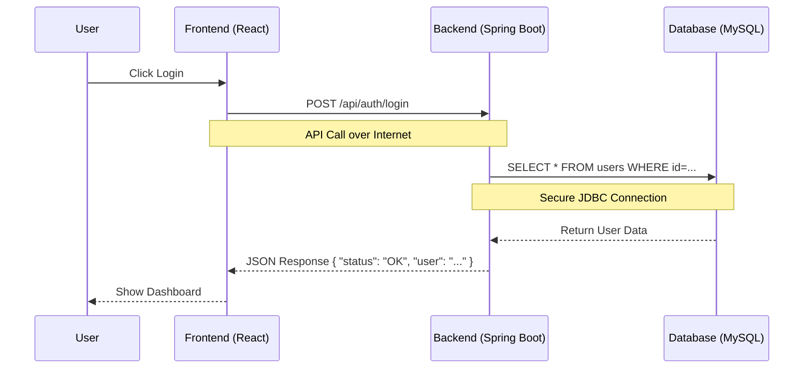

# Technical Architecture & System Flow

This document explains the internal working of the Vision Public School (VPS) application. It is designed for developers or anyone wanting to understand "how it works under the hood".

## 1. High-Level System Architecture

The application checks follow a standard **3-Tier Architecture**:
1.  **Presentation Layer (Frontend)**: React.js (hosted on Vercel).
2.  **Application Layer (Backend)**: Spring Boot (hosted on Render).
3.  **Data Layer (Database)**: MySQL (hosted on Aiven).

### **System Diagram**
```mermaid
graph LR
    User[User (Browser)] -- "1. HTTP Requests (JSON)" --> Frontend[Frontend (React/Vercel)]
    Frontend -- "2. REST API Calls" --> Backend[Backend (Spring Boot/Render)]
    Backend -- "3. JDBC Connection" --> DB[(MySQL Database/Aiven)]
    
    subgraph Cloud Infrastructure
        Frontend
        Backend
        DB
    end
```

---

## 2. How the Connections Work

### **A. Frontend to Backend (The API Link)**
*   **Frontend**: The React app runs in the user's browser. It doesn't know about the database directly.
*   **Connection**: It connects to the Backend using a URL defined in `src/config.js`.
    *   URL: `https://vps-hqtk.onrender.com`
*   **Mechanism**: When a user clicks a button, React uses **Axios/Fetch** to send an HTTP request to that URL.

### **B. Backend to Database (The Data Link)**
*   **Backend**: The Spring Boot app runs on a server (Render). It is the "brain".
*   **Connection**: It connects to the MySQL database using credentials in `application.properties`.
    *   URL: `jdbc:mysql://...aivencloud.com...`
    *   Username/Password: Secured env variables.
*   **Mechanism**: It uses **Hibernate/JPA** to translate Java code into SQL queries.

---

## 3. Step-by-Step Data Flow (Example: "Login")

Here is exactly what happens when a student logs in:

### **Step 1: User Interaction**
*   **User**: Enters ID "1001" and Password "1234" and clicks "Login".

### **Step 2: Frontend Request**
*   **React**: Packages this data into a JSON object: `{"admissionNo": "1001", "password": "1234"}`.
*   **Action**: Sends a `POST` request to `https://vps.../api/auth/login`.

### **Step 3: Backend Processing**
*   **Controller**: `AuthController.java` receives the request.
*   **Service**: Checks if "1001" exists and if the password matches.
*   **Database Query**: The backend asks the database: *"Find user with ID 1001"*.

### **Step 4: Database Response**
*   **MySQL**: Finds the row for "Sumit Kumar" and returns it to the Backend.

### **Step 5: Final Response**
*   **Backend**: Sends a **Success** signal + User Details (Name, Role, Class) back to React.
*   **Frontend**: Saves the user info and redirects the browser to the **Dashboard**.

### **Visual Flow Diagram**


---

## 4. Key Technologies
*   **Frontend**: React, Vite, CSS Modules.
*   **Backend**: Java 17, Spring Boot 3, Spring Data JPA.
*   **Database**: MySQL 8.
*   **Hosting**: Vercel (Front), Render (Back), Aiven (DB).
