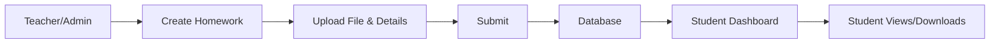
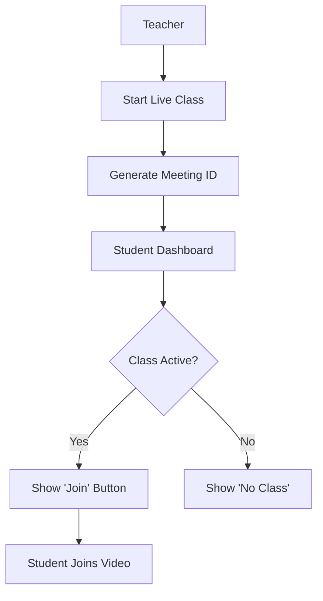
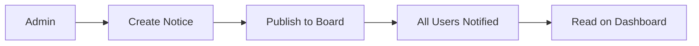
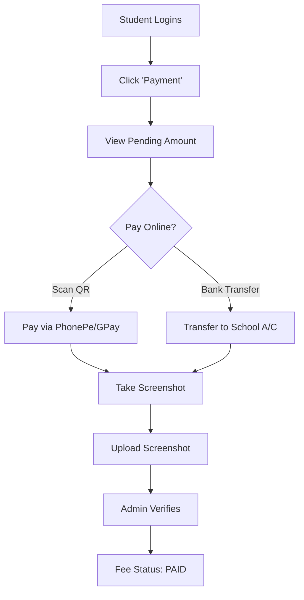
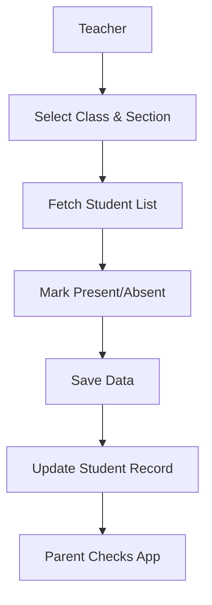

# Vision Public School (VPS) - User Manual

Welcome to the **Vision Public School (VPS) Application Guide**.
This document explains how to use every feature of the school management system. It is written for everyone—students, parents, teachers, and administrators.

---

## 🚀 1. Accessing the System

### **How to Login**
1.  Open your web browser (Chrome, Edge, Firefox, etc.).
2.  Go to the website URL: `[Your-Frontend-URL]` (e.g., `https://vps-frontend.vercel.app`).
3.  You will see the **Login Screen**.
4.  **Admission No / User ID**: Enter your unique ID.
    *   *Admins*: Use `admin`.
    *   *Students*: Use your Admission Number (e.g., `1001`).
5.  **Password**: Enter your secret password.
    *   *Default Admin Password*: `admin123`.
6.  Click the blue **"Login"** button.

### **Login Flow Diagram**
```mermaid
graph LR
    A[Start] --> B[Enter URL]
    B --> C{Have Account?}
    C -- Yes --> D[Enter ID & Password]
    C -- No --> E[Contact Admin]
    D --> F{Valid?}
    F -- Yes --> G[Login Success (Dashboard)]
    F -- No --> H[Show Error Message]
    H --> D
```

---

## 🖥️ 2. The Dashboard
Once logged in, you see the **Dashboard**. This is your "Home Base".
*   **Menu (Left Side)**: Shows all the things you can do. Click any item to go there.
*   **Quick Stats**: Colored cards showing summary numbers (like "Total Students", "Total Fees").

---

## 📚 3. Academic Features

### **Homework** 📝
*Teachers assign work here. Students check it here.*
*   **To View Homework**: Click "Homework" in the menu. You will see a list of assignments.
*   **To Add Homework (Teachers/Admin)**:
    1.  Click "Add Homework".
    2.  Fill in the Details: Title, Description, Class, Section.
    3.  (Optional) Upload a file (PDF/Image) using the "Choose File" button.
    4.  Click "Submit".

### **Homework Workflow**


### **Syllabus** 📖
*See what topics will be covered in class.*
*   **View**: Click "Syllabus". Download any attached files to read them.
*   **Upload (Teachers/Admin)**:
    1.  Click "Add Syllabus".
    2.  Select Subject, Class, and Section.
    3.  Attach the document.
    4.  Click "Save".

### **Study Material** 🎒
*Extra notes and books.*
*   Works exactly like Syllabus but for general reading materials.

### **Questions & Doubt Clearing** ❓
*Ask questions and get answers.*
*   **Ask**: Type your question in the box and click "Post".
*   **Answer**: Click on a question to type an answer.

### **Live Classes** 📹
*Join online video sessions.*
*   Click "Live Class".
*   If a class is active, you will see a **"Join"** button. Click it to enter the video room.

### **Live Class Workflow**


---

## 📢 4. Communication

### **Notices Board** 📌
*Important announcements from the school.*
*   **View**: Click "Notices". Read the latest news cards.
*   **Create (Admin)**:
    1.  Click "Add Notice".
    2.  Type the Title (Headline) and Content (Details).
    3.  Click "Post".

### **Notice Board Workflow**


---

## 💰 5. Fees & Payments

### **For Parents/Students** 💳
1.  Click **"Payment"** in the menu.
2.  You will see your **Pending Amount**.
3.  **To Pay**:
    *   Scan the QR Code shown on screen with any UPI App (GPay, PhonePe).
    *   OR
    *   Click "Upload Receipt" if you paid externally and upload the screenshot.

### **Fee Payment Diagram**


### **For Accountants/Admins** 📊
*   **Check Reports**: Click **"Reports"**.
*   **Active Users**: Click **"Active Users"** to see who is online right now.

---

## 🏆 6. Results & Attendance

### **Attendance** 📅
*   **View**: Click "Attendance" to see a calendar.
    *   **Green**: Present using "P".
    *   **Red**: Absent using "A".
*   **Mark Attendance (Teachers)**:
    1.  Select Class and Section.
    2.  You will see the list of students.
    3.  Click "Present" or "Absent" next to each name.
    4.  Click "Save Today's Attendance".

### **Attendance Marking Workflow**


### **Mark Sheets (Results)** 📜
*   Click **"Mark Sheet"**.
*   Select the Exam Name (e.g., "Final Term") and Class.
*   You can view or download the report card.

---

## 🛠️ 7. Troubleshooting (Help)

**"I forgot my password!"**
*   Contact the School Administrator. They can reset it for you from the Admin Dashboard.

**"The website isn't loading."**
*   Check your internet connection.
*   Try a different browser (Chrome is recommended).

**"I entered the details but it says 'Invalid Credentials'."**
*   Make sure your Caps Lock is off.
*   Double-check your Admission Number (ID) and Password.

---
*Generated for Vision Public School (VPS)*

---

## 📄 How to Save as PDF

Since this is a digital document, you can easily save it as a PDF:

**Option 1: Using VS Code (Best Quality)**
1.  Open this file in VS Code.
2.  Right-click anywhere in the preview -> select **Print to PDF** (or use the "Markdown PDF" extension).

**Option 2: Using Online Tools**
1.  Copy all the text in this file.
2.  Paste it into one of these free websites:
    *   [md2pdf.netlify.app](https://md2pdf.netlify.app/)
    *   [Dillinger.io](https://dillinger.io/) (Select Export -> PDF)
    *   [StackEdit.io](https://stackedit.io/) (Select Export -> PDF)
3.  Dowload the PDF file.
